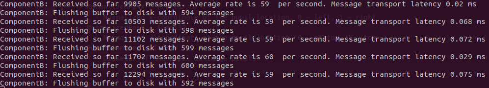

# Ingesting data from Eye Tracking Device (simulated)


## Pre-reqs:

- Python 3.7
- Anaconda

## Installation:

```
$ git clone https://github.com/tensoralex/mx-challenge
$ cd mx-challenge
```

```
$ conda env update -f environment.yaml
$ conda activate mx-challenge

$ pip install -e .
```

### Run tests:

```
$ pytest
```

### Configuration:
```
$ cat config.yaml

componentA:
  connect_to: 127.0.0.1
  port: 12345
  num_of_devices: 1

componentB:
  output_file: output.avro
  ip_whitelist:
    - 127.0.0.1
  listen_on: 0.0.0.0
  port: 12345

```

### Run application:

Component B needs to be started first.


```
python run_componentB.py
```

```
python run_componentA.py
```


### Output:

Messages are saved into AVRO file format.
By default output.avro

[See Jupyter notebook](analyse_output_avro.ipynb) for example of loading avro into Pandas dataframe.


### Design:

- Component B receives messages from Component A via TCP connection.
Parameter ```ip_whitelist``` in the config.yaml determines from which IPs messages will be accepted.

- Component A reads simulated messages (from eye tracker) and stores them into internal queue.
- Once connected to the server it will push messages to Component B.

- Component B accumulates messages and flushes them every 10 seconds into AVRO file.

### Message Format:
- Timestamp : Seconds: Int64U, Nanoseconds: Int32U
- Timestamp of message received
- ID : Boolean
    - 0 – left eye, 1 – right eye
- Confidence : Float32
    - 0 – no confidence, 1 – perfect confidence
- NormalizedPosX : Float32
    - Normalized x-coordinate of the pupil location, 0 – left, 1 – right
- NormalizedPosY : Float32
    - Normalized y-coordinate of the pupil location, 0 – bottom, 1 – top
- PupilDiameter : Int32U
    - Diameter of the pupil in image pixels
